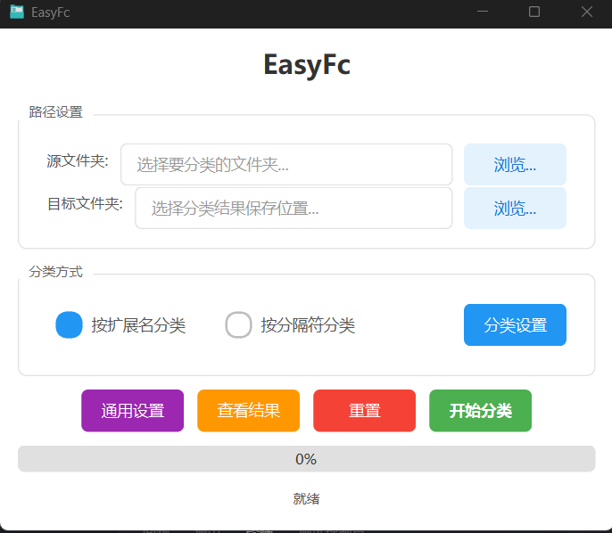

# EasyFc - 智能文件分类工具

<div align="center">


**一款简洁高效的桌面文件分类管理工具**

[](https://www.python.org/)
[](https://pypi.org/project/PySide6/)
[](LICENSE)
[](https://www.microsoft.com/windows)

</div>

---

## 📖 目录

- [项目概述](#项目概述)
- [核心功能](#核心功能)
- [技术架构](#技术架构)
- [目录结构](#目录结构)
- [环境配置](#环境配置)
- [使用方法](#使用方法)
- [配置说明](#配置说明)
- [开发指南](#开发指南)
- [常见问题](#常见问题)
- [项目截图](#项目截图)
- [许可证](#许可证)

---

## 项目概述

**EasyFc**（Easy File Classifier）是一款基于 PySide6 开发的桌面文件分类工具，旨在帮助用户快速、高效地整理杂乱的文件。通过智能识别文件扩展名或文件名中的分隔符，自动将文件归类到相应的文件夹中，极大地提升文件管理效率。

### 目标用户

- 📁 需要批量整理下载文件夹的用户
- 💼 需要归档办公文档的职场人士
- 📊 需要管理数据文件的数据分析师
- 🎨 需要整理素材文件的设计师
- 🖥️ 需要维护项目文件的开发者

### 使用场景

| 场景 | 描述 |
|------|------|
| 下载文件夹整理 | 将下载文件夹中的各类文件按类型自动分类 |
| 项目文件归档 | 将项目中的源代码、文档、资源文件分类存放 |
| 素材库管理 | 按图片、视频、音频等类型整理素材文件 |
| 文档库整理 | 将各类办公文档按格式分类存储 |

---

## 核心功能

### 🏷️ 扩展名分类

根据文件扩展名自动识别文件类型并分类：

- **内置 200+ 种文件类型映射**，覆盖常见文件格式
- **支持自定义扩展名映射**，满足个性化需求
- **智能识别**：未配置的扩展名自动以扩展名大写作为分类名称

```
示例：
document.pdf    → PDF 文件/
photo.jpg        → JPEG 图像/
video.mp4        → MP4 视频/
source.py        → Python 文件/
```

### ✂️ 分隔符分类

根据文件名中的分隔符提取分类名称：

- **灵活的分隔符配置**：支持下划线、中划线、括号等多种分隔符
- **位置可调**：可指定起始和结束分隔符的位置
- **实时预览**：配置时实时显示提取效果

```
示例（使用下划线分隔）：
img_2026年2月1日_54864848.png  → 2026年2月1日/
photo-2026-02-01-001.jpg       → 2026/
document[重要]_v1.pdf          → 重要/
```

### ⚙️ 通用设置

| 设置项 | 说明 |
|--------|------|
| 删除源文件 | 分类完成后是否删除源文件（默认保留） |
| 扫描子文件夹 | 是否递归扫描子目录 |
| 指定深度 | 限制子文件夹扫描深度 |

### 📊 结果统计

- 实时显示处理进度
- 分类完成后展示成功/失败统计
- 详细记录失败文件及错误原因
- 支持查看分类结果详情

---

## 技术架构

### 技术栈

| 技术 | 版本 | 用途 |
|------|------|------|
| Python | 3.10+ | 开发语言 |
| PySide6 | 6.10.2 | GUI 框架 |
| Nuitka | 4.0.1 | 打包工具 |
| pydantic | 2.12.5 | 数据验证 |

### 架构设计

项目采用 **MVVM（Model-View-ViewModel）** 架构模式，实现业务逻辑与 UI 的完全解耦：

```
┌─────────────────────────────────────────────────────────────┐
│                    Presentation Layer                       │
│  ┌─────────────────────────────────────────────────────┐    │
│  │                    Views (视图层)                    │    │
│  │  • FileClassifierWindow (主窗口)                     │    │
│  │  • ExtensionSettingsDialog (扩展名设置对话框)         │    │
│  │  • DelimiterSettingsDialog (分隔符设置对话框)         │    │
│  │  • GeneralSettingsDialog (通用设置对话框)             │    │
│  │  • ResultDialog (结果对话框)                         │    │
│  └─────────────────────────────────────────────────────┘    │
└─────────────────────────────────────────────────────────────┘
                              │
                              ▼
┌─────────────────────────────────────────────────────────────┐
│                   Application Layer                         │
│  ┌─────────────────────────────────────────────────────┐    │
│  │                 ViewModels (视图模型层)              │    │
│  │  • FileClassifierViewModel (主视图模型)              │    │
│  │  • ClassificationWorker (分类工作线程)               │    │
│  └─────────────────────────────────────────────────────┘    │
└─────────────────────────────────────────────────────────────┘
                              │
                              ▼
┌─────────────────────────────────────────────────────────────┐
│                     Domain Layer                            │
│  ┌─────────────────────────────────────────────────────┐    │
│  │                   Models (模型层)                    │    │
│  │  • FileClassifier (分类器基类)                        │    │
│  │  • ExtensionClassifier (扩展名分类器)                 │    │
│  │  • DelimiterClassifier (分隔符分类器)                 │    │
│  └─────────────────────────────────────────────────────┘    │
└─────────────────────────────────────────────────────────────┘
                              │
                              ▼
┌─────────────────────────────────────────────────────────────┐
│                 Infrastructure Layer                        │
│  ┌─────────────────────────────────────────────────────┐    │
│  │                    Utils (工具层)                    │    │
│  │  • file_utils (文件操作工具)                          │    │
│  │  • extension_config_manager (扩展名配置管理)          │    │
│  │  • delimiter_config_manager (分隔符配置管理)          │    │
│  └─────────────────────────────────────────────────────┘    │
└─────────────────────────────────────────────────────────────┘
```

### 设计原则

- **单一职责**：每个模块只负责一个功能
- **开闭原则**：对扩展开放，对修改关闭
- **线程安全**：耗时操作在独立线程执行，不阻塞 UI

---

## 目录结构

```
EasyFc/
├── config/                          # 配置文件目录
│   ├── extension_configs.json       # 扩展名映射配置
│   └── delimiter_configs.json       # 分隔符配置方案
│
├── models/                          # 数据模型层
│   ├── __init__.py
│   └── file_classifier.py           # 文件分类器模型
│
├── viewmodels/                      # 视图模型层
│   ├── __init__.py
│   └── file_classifier_viewmodel.py # 主视图模型
│
├── views/                           # 视图层
│   ├── __init__.py
│   ├── file_classifier_window.py    # 主窗口
│   ├── dialogs/                     # 对话框
│   │   ├── __init__.py
│   │   ├── extension_settings_dialog.py
│   │   ├── delimiter_settings_dialog.py
│   │   ├── general_settings_dialog.py
│   │   └── result_dialog.py
│   ├── styles/                      # 样式定义
│   │   ├── __init__.py
│   │   └── common_styles.py
│   └── widgets/                     # 自定义控件
│       └── __init__.py
│
├── utils/                           # 工具类
│   ├── __init__.py
│   ├── file_utils.py                # 文件操作工具
│   ├── extension_config_manager.py  # 扩展名配置管理
│   └── delimiter_config_manager.py  # 分隔符配置管理
│
├── styles/                          # QSS 样式表
│   └── file_classifier.qss          # 主样式文件
│
├── out/                             # 构建输出目录
│   ├── EasyFC.exe                   # 可执行文件
│   ├── config/                      # 运行时配置
│   └── styles/                      # 运行时样式
│
├── .env/                            # Python 虚拟环境
├── .trae/                           # 项目规则配置
├── main.py                          # 应用入口
├── requirements.txt                 # 依赖列表
├── file.ico                         # 应用图标
└── README.md                        # 项目文档
```

---

## 环境配置

### 系统要求

- **操作系统**：Windows 10/11
- **Python**：3.10 或更高版本
- **内存**：建议 4GB 以上
- **磁盘**：至少 100MB 可用空间

### 安装步骤

#### 方式一：直接使用可执行文件

1. 从 `out/` 目录获取 `EasyFC.exe`
2. 双击运行即可

#### 方式二：从源码运行

```powershell
# 1. 克隆项目
git clone https://github.com/laosunmaker/EasyFc.git
cd EasyFc

# 2. 创建虚拟环境
python -m venv .env

# 3. 激活虚拟环境
.\.env\Scripts\Activate.ps1

# 4. 安装依赖
pip install -r requirements.txt

# 5. 运行应用
python main.py
```

### 依赖说明

| 依赖包 | 版本 | 用途 |
|--------|------|------|
| PySide6 | 6.10.2 | Qt GUI 框架 |
| pydantic | 2.12.5 | 数据验证 |
| Nuitka | 4.0.1 | Python 打包工具 |

---

## 使用方法

### 快速开始

1. **选择源文件夹**：点击"浏览..."按钮，选择需要分类的文件夹
2. **选择目标文件夹**：选择分类后文件的存放位置
3. **选择分类方式**：
   - 按扩展名分类：根据文件类型自动分类
   - 按分隔符分类：根据文件名中的分隔符提取分类
4. **配置分类规则**：点击"分类设置"进行详细配置
5. **开始分类**：点击"开始分类"按钮执行分类操作

### 扩展名分类配置

1. 点击"分类设置"打开扩展名映射设置对话框
2. 查看或修改现有的扩展名映射
3. 可添加新的映射：输入扩展名和分类名称
4. 可删除不需要的映射
5. 点击"保存"保存配置

### 分隔符分类配置

1. 选择"按分隔符分类"模式
2. 点击"分类设置"打开分隔符设置对话框
3. 选择预设配置方案或手动配置：
   - 起始分隔符：开始提取的分隔符
   - 结束分隔符：结束提取的分隔符
   - 起始位置：第几个起始分隔符
   - 结束位置：第几个结束分隔符（-1 表示末尾）
4. 预览区域实时显示提取效果
5. 点击"确定"应用配置

### 通用设置

点击"通用设置"可配置：

- **删除源文件**：分类后是否删除原始文件
- **扫描子文件夹**：是否递归处理子目录
- **指定深度**：限制扫描深度

---

## 配置说明

### 扩展名配置文件 (extension_configs.json)

```json
{
    "default": {
        "txt": "文本文件",
        "pdf": "PDF 文件",
        "jpg": "JPEG 图像",
        "png": "PNG 图像",
        "mp4": "MP4 视频",
        "mp3": "MP3 音频",
        "zip": "压缩文件",
        "py": "Python 文件"
    }
}
```

### 分隔符配置文件 (delimiter_configs.json)

```json
[
    {
        "name": "下划线分隔-提取中间",
        "description": "从文件名中提取第一个和第二个下划线之间的内容",
        "delimiter_start": "_",
        "delimiter_end": "_",
        "start_pos": 1,
        "end_pos": 2,
        "preview_example": "img_2026年2月1日_54864848.png"
    }
]
```

### 分隔符位置说明

| 位置值 | 含义 |
|--------|------|
| 正整数 n | 第 n 个分隔符 |
| -1 | 文件开头（起始位置）或文件末尾（结束位置） |

---

## 开发指南

### 代码规范

- **命名规范**：清晰命名优于简短命名，布尔变量使用 `is_`/`has_` 前缀
- **函数规范**：单一职责，参数不超过 3 个，长度不超过 50 行
- **注释规范**：解释 Why 而非 What，公共 API 必须添加注释
- **导入顺序**：标准库 → 第三方库 → PySide6 → 本地模块

### 添加新的分类器

1. 在 `models/file_classifier.py` 中创建新的分类器类，继承 `FileClassifier`
2. 实现 `classify` 方法
3. 在 `viewmodels/file_classifier_viewmodel.py` 中添加对应的处理逻辑
4. 在视图中添加相应的 UI 控件

### 添加新的对话框

1. 在 `views/dialogs/` 目录创建新的对话框文件
2. 继承 `QDialog` 并实现 UI 和逻辑
3. 在 `views/dialogs/__init__.py` 中导出
4. 在 `views/styles/common_styles.py` 中添加样式

### 构建可执行文件

```powershell
# 使用 Nuitka 构建
python -m nuitka --standalone --onefile --windows-console-mode=disable --output-dir=out main.py
```

---

## 常见问题

### Q: 分类后文件名重复怎么办？

A: 程序会自动在重复文件名后添加编号，如 `file (1).txt`。

### Q: 分类失败怎么办？

A: 点击"查看结果"按钮查看详细的错误信息，常见原因包括：
- 文件被其他程序占用
- 目标目录权限不足
- 磁盘空间不足

### Q: 如何恢复默认配置？

A: 在扩展名设置对话框中点击"加载默认"按钮。

### Q: 支持哪些文件类型？

A: 内置支持 200+ 种文件类型，涵盖文档、图片、视频、音频、压缩包、源代码等常见格式。

---

## 项目截图

<div align="center">



*主窗口界面*

</div>

---

## 许可证

本项目采用 MIT 许可证。详见 [LICENSE](https://github.com/laosunmaker/EasyFC?tab=MIT-1-ov-file) 文件。

---

## 致谢

- [PySide6](https://pypi.org/project/PySide6/) - Qt for Python
- [Nuitka](https://nuitka.net/) - Python 打包工具
- [pydantic](https://pydantic-docs.helpmanual.io/) - 数据验证库

---

<div align="center">

**如果这个项目对您有帮助，请给一个 ⭐ Star 支持一下！**

Made with ❤️ by lsmaker

</div>
